# TIME IS UP
## 1. Historial de versiones
### GDD versión 0.1.0:
   - Se ha añadido pegi al apartado de introducción
   - Se ha completado el apartado de monetización y modelo de negocio
   - Se ha separado los apartados de personajes y enemigos de la narrativa
   - Se han completado los apartados de jugabilidad, personajes jugables, enemigos y controles
   - Se ha creado el apartado de interfaces y pantalla, diseño de escenario y música y sonido
   - Se han añadido los diseños de personajes a los apartados de arte
   - Se han revisado los apartados existentes
### GDD versión 0.2.0: 
   - Se ha añadido el postmortem de la versión Alpha
   - Se ha ampliado el apartado de la narrativa del juego
   - Se ha completado el turn around de todos los personajes jugables
   - Se ha añadido el turn around de cinco enemigos
   - Se ha completado el diseño de las interfaces del juego
   - Se ha añadido la versión final del primer escenario
   - Se ha añadido el segundo escenario
   - Se han modelado y texturizado todos los personajes menos el final
   - Se han riggeado y animado todos los personajes, tanto enemigos como jugables
     
### GDD versión 1.0.0:
   -	Se ha añadido el postmortem de la versión Beta
   -	Se ha completado el estudio de color de los personajes
   -	Se ha completado el estudio de color de los personajes
   -	Se ha modificado los colores de los modelos 3D
   -	Se han implementado animaciones nuevas de los enemigos
   -	Se han terminado de implementar las habilidades
   -	Se ha mejorado la implementación de las interfaces
   -	Se ha mejorado el feedback de las interfaces

GDD versión 1.0.1
-	Se ha añadido el postmortem de la versión Gold
-	Se ha llevado a cabo las estrategias de publicación y redes
-	Se han elaborado y programado publicaciones para las redes sociales

## 2. Introducción
El presente documento introduce el Game Design Document (GDD) del videojuego “Time Is Up”. A lo largo del desarrollo de este, se explicará a detalle las características que lo definen, así como el propósito del juego y su modelo de negocio. 

### Concepto general
“Time Is Up” consiste en un videojuego competitivo 3D, basado en la temática de “Arena”, en la que se concentran dos o más jugadores que competirán entre sí para ganar tiempo de partida. 
Las partidas consistirán alrededor de 15-20 minutos en la que los jugadores tendrán un tiempo base (5 minutos) y necesitarán aumentarlo para que la partida no acabe. Para ganar tiempo tendrán que matar oleadas de enemigos y hacerse más fuertes para así poder derrotar al contrincante y que este se quede sin tiempo.

### Público general
Al ser un juego competitivo, nuestro objetivo es hacer llegar nuestro videojuego a un público mayor de 16 años, haciendo énfasis en el público más joven.
Se busca que el usuario haga uso de sus habilidades y conocimientos como jugador para intentar llegar a ser el mejor. Aquellos jugadores que hayan tenido una experiencia previa con shooters o juegos de acción, tendrán una ventaja frente a los jugadores noveles.

### Propósitos del juego
El objetivo principal del juego competitivo es proporcionar una experiencia emocionante y desafiante para los jugadores, donde se pongan a prueba y desarrollen tanto sus habilidades estratégicas como su destreza física y mental en un entorno de competencia directa. Los jugadores deberán mejorar constantemente para superar a sus oponentes, adaptándose a cambios en las mecánicas del juego y optimizando su rendimiento.

### Plataformas
Time Is Up estará disponible para WebGL, por lo que será posible jugarlo a través de ordenador con teclado y ratón, y desde móvil con controles táctiles. 

### Sinópsis
En un universo al borde de la destrucción, una fuerza desconocida ha convocado a los mejores guerreros de distintas realidades a Fricb, una arena mística donde el tiempo es la única moneda de supervivencia. Estos héroes no llegaron por voluntad propia; han sido atraídos por una entidad enigmática que controla el destino del cosmos. Su misión es clara: luchar y ganar tiempo, o ver cómo su mundo se desvanece en el olvido. En cada combate, dos equipos se enfrentan frenéticamente contra oleadas de enemigos y entre sí, para acumular tiempo vital que podría ser la única salvación de sus respectivos universos. Solo un equipo logrará alargar la vida de su mundo, mientras el otro verá cómo el reloj marca el fin de su realidad. ¿Tienes lo necesario para derrotar a tus enemigos y salvar tu universo antes de que Time Is Up?

### Género
El videojuego "Time Is Up" es del género arena competitiva en 3D. Está diseñado para partidas cortas y frenéticas en las que los jugadores deben competir entre sí, enfrentándose a oleadas de enemigos para ganar tiempo de juego. Combina elementos de shooters en primera persona y gestión de recursos, donde el tiempo es el recurso clave.

### Estilo visual
El estilo del proyecto se desarrollará en 3D, tanto el escenario como los personajes, con texturas cartoon para que sea más cercano al jugador. Las partidas serán en primera persona, para que el juego sea más inmersivo.

### PEGI
El juego posee un PEGI 7, puesto que se puede observar violencia implícita al tener que eliminar a tus enemigos, pero no llega a ser muy gráfica.

## 3. Monetización y modelo de negocio
Se ha optado por un juego **Free To Play** para que se pueda llegar a la mayor cantidad de público posible y que todos puedan disfrutar sin compromiso.

Se ha optado por un modelo de negocio Freemium, con monetización a través de microtransacciones. De esta forma, cualquiera que quiera acceder al juego podrá realizarlo sin problemas y la empresa se mantendrá a flote a través de pagos opcionales dentro del juego.
### Mapa de empatía

   

1. ¿Qué piensa y siente el jugador?
   
   Los jugadores quieren destacar frente a sus oponentes y ser reconocidos por sus habilidades y estilo de juego único. Disfrutan la adrenalina de competir bajo presión y personalizar sus avatares para reflejar sus logros. Se frustran si no pueden dedicar el tiempo suficiente para mejorar y les molesta cometer errores que les hacen perder tiempo en las partidas.
2. ¿Qué ve?
   
   El juego ofrece gráficos cartoon vibrantes y enemigos visualmente distintos que facilitan identificar sus habilidades y recompensas, decisión tomada para que el juego llame la atención de los jugadores gracias a su apartado artístico. Además, los jugadores están acostumbrados a ver poca variedad en los enemigos, siendo estos muy similares y poco reconocibles, aspecto que queremos desarrollar para distinguirnos. En el entorno externo, los jugadores ven a otros compartiendo sus skins y logros en redes sociales, mientras que influencers muestran estrategias para maximizar el uso del tiempo y progresar.
3. ¿Qué dice y hace?

   Dentro del juego, participan en chats y forman equipos para discutir tácticas y celebrar o lamentar sus resultados, función implementada para facilitar la comunicación entre jugadores, debido a la falta de estos medios en otros juegos competitivos, que hace que los jugadores dependan de medios externos, o directamente no expresen sus opiniones y logros. Fuera del juego, comentan en foros, comparten clips de sus jugadas y participan en eventos organizados por la comunidad, demostrando su compromiso. El hecho de que los jugadores de nuestro juego participen en chats influye sobre otros jugadores, a los que incitan a participar más en la comunidad del juego.
4. ¿Qué oye?

    Reciben recomendaciones de amigos y otros jugadores sobre qué mejorar y qué comprar en la tienda, lo que puede influenciar a los jugadores a tomar ciertas decisiones de compra, ya sean buenas o malas. También siguen a influencers que comparten estrategias y discuten nuevas actualizaciones y mecánicas, lo que les ayuda a adaptarse a los cambios del juego.
5. ¿Qué esfuerzos realiza?

    Los jugadores invierten tiempo en dominar estrategias y aprender nuevas mecánicas, preocupándose por no poder dedicarle suficiente tiempo para progresar al mismo ritmo que otros. Temen perder tiempo en errores pequeños y buscan optimizar cada segundo en las partidas. Por ello, para evitar estas frustraciones, buscamos implementar un sistema que recompense a los jugadores con skins y efectos por el tiempo dedicado en el juego, para incitarles a continuar mejorando su técnica.
6. ¿Qué resultados espera?

    Aspiran a ser los últimos en pie, acumulando colecciones completas de skins que reflejen su progreso. Buscan reconocimiento en la comunidad, participar en torneos y compartir sus logros para demostrar su dominio del juego y obtener notoriedad.
### Caja de herramientas

   

El juego es gratuito con un modelo **freemium** que monetiza mediante microtransacciones estéticas (skins y efectos visuales) y un **Battle Pass**. Se dirige a jugadores competitivos de entre 16 y 30 años que valoran la personalización y disfrutan de partidas rápidas. 
La propuesta de valor se centra en ofrecer una experiencia competitiva con opciones visuales únicas sin alterar la jugabilidad.

1. Flujo de Ingresos: los ingresos provienen de **ventas de microtransacciones**, **Battle Passes** y **eventos especiales** con contenido limitado.
2. Oferta de Valor:
    - **Juego competitivo gratuito** con mecánicas basadas en la gestión del tiempo.
    - **Personalización estética** (skins, efectos visuales, emotes) para destacar visualmente sin ventajas en el juego.
    - **Eventos y torneos** que recompensan a los jugadores con contenido exclusivo.

3. Relaciones:
    - **Recibimos**: Ingresos a través de compras opcionales y visibilidad mediante el contenido compartido por la comunidad.
    - **Ofrecemos**: Una experiencia competitiva gratuita con opciones estéticas y contenido adicional a través de eventos y desafíos.
      
4. Red de Valor:
    - **Jugadores principales**: Compran contenido y promueven la comunidad.
    - **Jugadores casuales**: Participan esporádicamente y realizan compras menores.
    - **Influencers**: Generan contenido, promocionan eventos y atraen nuevos jugadores.
    - **Plataformas de distribución**: Steam y Epic Games como canales de venta y visibilidad.
5. Valor Generado:
    - **Lo que ofrecemos**: Juego gratuito, personalización y recompensas limitadas.
    - **Lo que recibimos**: Ingresos, compromiso de la comunidad y promoción indirecta.
  
### Monetización
El modelo de monetización para este juego competitivo basado en arenas y con una estética cartoon se centrará en aprovechar un sistema **freemium** con microtransacciones de contenido puramente estético. 
El objetivo es que el juego siga siendo gratuito y accesible, mientras que las compras dentro del juego sean atractivas, variadas y opcionales, ofreciendo valor añadido a los jugadores sin influir en la jugabilidad. A continuación, se detalla cómo se podría estructurar el sistema de monetización:
1. **Estrategia general de monetización**
   
    La monetización del juego se basará en una combinación de los siguientes métodos:

   1. **Microtransacciones de Cosméticos**: El principal método de monetización. Los jugadores podrán comprar skins, efectos visuales para habilidades, diseños de armas y otros elementos que no influyen en el rendimiento del juego.
   2. Battle Pass (Pase de Temporada): Un pase premium con recompensas exclusivas. Los jugadores pueden desbloquear contenido adicional al completar desafíos y objetivos, manteniendo un sentido de progresión.
   3. Eventos Temáticos y Contenido de Tiempo Limitado: Skins, efectos y personalizaciones especiales disponibles solo durante eventos o temporadas específicas.
   4. Monetización de Comunidad: Integración de ítems diseñados por la comunidad o skins colaborativas con creadores de contenido, donde un porcentaje de las ganancias va a los creadores.

2. **Tipos de microtransacciones**
   
    Las microtransacciones se dividirán en varias categorías para ofrecer opciones y variedad a los jugadores:

    1. **Skins de Personaje**
        - Se lanzarán skins basadas en temáticas (fantasía, futurista, cyberpunk, etc.).
        - Skins de nivel básico: Skins visualmente atractivas, pero con un precio reducido. Perfectas para jugadores casuales que buscan personalizar su personaje sin gastar demasiado.
        - Skins de nivel épico o legendario: Skins con efectos visuales avanzados (partículas, animaciones personalizadas) que tendrán un precio superior.
    2. **Efectos Visuales para Habilidades**
        - Los jugadores podrán comprar efectos únicos que cambian la apariencia de habilidades específicas (por ejemplo, un aura de tiempo distorsionado, explosiones de colores, etc.).
        - Algunos efectos solo estarán disponibles durante eventos especiales para crear un sentido de urgencia y exclusividad (explosiones de nieve en navidad, calaveras en halloween, etc).
    3. **Apariencia de Aliados (Enemigos Tanques Aliados)**
        - Los enemigos tanque, una vez convertidos en aliados, podrán tener skins especiales.
        - Los jugadores pueden comprar apariencias únicas para sus aliados para que combinen con sus propias skins.
    4. **Chromas para skin base**
        - Personalización visual de las armas principales y secundarias.
        - Incluye patrones, texturas exclusivas y efectos visuales.
    5. **Animaciones y Emotes**
        - Emotes personalizables que los jugadores pueden usar durante las partidas.
        - Animaciones de victoria y derrota personalizadas.
    6. **Paquetes de Cosméticos**
        - Ofrecer paquetes que incluyan varias skins y efectos a un precio reducido.
        - Paquetes de temporada con temáticas específicas (Halloween, Navidad, Verano, etc.).

3. **Battle Pass (Pase de Temporada)**
   
    El Pase de Temporada es una herramienta diseñada para mantener a los jugadores comprometidos durante un periodo específico,
ofreciendo recompensas exclusivas al completar desafíos y alcanzar ciertos hitos dentro del juego. Este sistema de monetización fomenta la progresión y recompensas por el tiempo invertido,
brindando un motivo para regresar y jugar regularmente.

    1. **Formato del pase**:
        - El pase tiene una duración de aproximadamente 2 meses, dividido en 10 niveles de recompensas.
        - Los jugadores pueden desbloquear dos líneas de recompensas: **Línea Gratuita y Línea Premium**.
            - **Línea Gratuita**: Ofrece recompensas como pequeñas cantidades de monedas del juego, chromas básicos y efectos visuales sencillos.
            - **Línea Premium**: Disponible solo para jugadores que compren el pase, incluye chromas/skins de nivel épico o legendario, emotes exclusivos, efectos visuales avanzados y otros elementos de personalización exclusivos.
    2. **Progresión en el Pase**:
        - Los jugadores obtienen experiencia para el pase al completar desafíos semanales y diarios:
            - **Desafíos diarios**: Ejemplos como "Mata 50 enemigos base" o "Defiende a tu aliado tanque durante 2 oleadas".
            - **Desafíos semanales**: Retos más grandes que requieren mayor dedicación, como "Acumula 30 minutos robados de tu oponente en una semana".
        - La experiencia acumulada desbloquea niveles dentro del pase, con recompensas que se vuelven más valiosas en niveles superiores.
    3. **Monetización del Pase**:
        - **Pase Premium**: Ofrecido a un precio accesible (por ejemplo, 9.99€) para cada temporada.
    4. **Recompensas Exclusivas**:
        - Los elementos del Pase Premium son exclusivos y no estarán disponibles en la tienda al final de la temporada, creando un sentido de urgencia y exclusividad.

4. **Sistema de moneda virtual**

    El juego utilizará una **moneda virtual** que se puede ganar en pequeñas cantidades a través de la jugabilidad y también adquirir mediante compras directas con dinero real.
   
    1. **Monedas de Tiempo**:
        - La moneda virtual se llama Chronos y será representada con un reloj de arena.
        - Los jugadores ganan pequeñas cantidades de Chronos completando ciertos desafíos, como misiones diarias, logros o alcanzando nuevas oleadas.
    2. **Compras con Chronos**:
        - Los Chronos se pueden usar para comprar cualquier skin, chroma, emote o efecto visual en la tienda.
        - También pueden usarse para adquirir el Pase de Temporada y desbloquear contenido adicional.
    3. **Paquetes de Monedas**:
        - Los jugadores pueden comprar Chronos con dinero real. Los precios varían según el paquete:
            - 100 Chronos – $4.99
            - 500 Chronos – $19.99 (10% adicional)
            - 1000 Chronos – $39.99 (20% adicional)
         
5. **Implementación de Marketing In-Game**

    Para asegurar que los jugadores estén al tanto de todas las opciones de monetización, el juego debe tener un sistema de marketing integrado que no sea intrusivo:
   
    1. **Tienda dentro del juego**:
        - Una tienda con secciones bien organizadas que incluye categorías como “Novedades”, “Skins de Temporada” y “Ofertas Limitadas”.
        - Uso de banners para destacar skins populares o eventos actuales.
    2. **Ofertas Especiales y Paquetes**:
        - Paquetes con descuentos por tiempo limitado (por ejemplo, "Paquete de Guerrero del Tiempo: Incluye skin de personaje + efecto de habilidad + emote especial").
        - Ofrecer promociones como "Compra 1000 Chronos y recibe un emote gratis".
    3. **Tienda Rotativa**:
        - Una tienda que cambia las skins y los cosméticos disponibles cada semana, para incentivar a los jugadores a visitar la tienda con regularidad.
### Modelo de Canvas
El **Business Model Canvas** es una herramienta que permite visualizar de manera integral el modelo de negocio de un producto o servicio. En este caso, se desglosa cada uno de los componentes clave del modelo de negocio para el juego.

   

1. **Propuesta de valor**

    El juego es gratuito con un enfoque innovador basado en la gestión del tiempo como recurso. Los jugadores compiten eliminando enemigos y robando tiempo a sus rivales. 
Además, se ofrece personalización estética con skins y efectos visuales que permiten destacar visualmente sin alterar la jugabilidad. Las mecánicas únicas de enemigos aliados y progresión del personaje añaden profundidad y mantienen el interés de los jugadores.

2. **Segmentos de clientes**

    El juego está dirigido a jugadores competitivos, principalmente jóvenes y adultos, a partir de los 16 años, que buscan acción y competencia en tiempo real. 
También se enfoca en aquellos que valoran la personalización y desean reflejar su estilo a través de la estética de los personajes.

3. **Canales**

    El juego se distribuirá digitalmente a través de plataformas como **Steam** y **Epic Games Store**. Las redes sociales (Instagram, Twitter, Facebook y TikTok) se usarán para promocionarlo y mantener la comunicación con la comunidad. Se publicará contenido en **YouTube** y **Twitch**, 
mientras que **Discord** se empleará para eventos y retroalimentación directa con los jugadores. Además, el marketing se reforzará mediante el **boca a boca (Word of mouth)**, que dependerá de la experiencia y recomendaciones de los propios jugadores.

4. **Relación con el Cliente**

    La relación se mantendrá activa mediante soporte a la comunidad, eventos regulares y actualizaciones constantes. Las redes sociales facilitarán la comunicación y permitirán a los jugadores compartir sus experiencias. También se organizarán torneos que ofrezcan recompensas exclusivas y fortalezcan la interacción con los jugadores.

5. **Fuentes de Ingresos**

    El juego generará ingresos a través de **microtransacciones** (venta de skins y efectos visuales), **Battle Pass** con recompensas exclusivas, y contenido limitado durante eventos especiales. También se venderán paquetes de monedas virtuales para adquirir ítems estéticos.

6. **Recursos Clave**

    El equipo de desarrollo compuesto por programadores, diseñadores y artistas es esencial para crear y mantener el juego. La infraestructura tecnológica, incluyendo servidores y software de desarrollo, es crucial para el funcionamiento y evolución del producto.

7. **Actividades Clave**

    Las principales actividades incluyen el desarrollo de contenido, marketing digital y promoción en redes. También se gestionará la comunidad para mantener el vínculo con los jugadores y 
se analizarán métricas de comportamiento y feedback para ajustar la estrategia. La venta de contenido digital (cosméticos) es otra actividad clave para monetizar el juego.

8. **Socios Clave**

    Los socios principales son las **plataformas de distribución** (Steam y Epic Games Store), **influencers** y **creadores de contenido** que ayudan a promocionar el juego. Además, artistas y diseñadores externos contribuyen con contenido estético exclusivo y proveedores de infraestructura aseguran un rendimiento estable del juego.

9. **Estructura de Costes**

    Los costos principales se dividen en desarrollo y mantenimiento del juego, marketing y publicidad, infraestructura tecnológica (servidores), y la inversión en recursos humanos (diseñadores, artistas, programadores y soporte a la comunidad). Estos gastos aseguran la calidad y la promoción continua del producto.

### Marketing

El plan de marketing para este juego se centrará en generar notoriedad, atraer a la audiencia adecuada y mantener a los jugadores comprometidos a largo plazo. El enfoque principal estará en maximizar la visibilidad a través de estrategias de marketing digital, 
colaboraciones con influencers y contenido generado por la comunidad. A continuación, se detallan los principales elementos del plan de marketing, segmentados en fases según el ciclo de vida del juego.

1. Objetivos de Marketing

    El plan de marketing busca atraer a jugadores a partir de 16 años que disfrutan de juegos multijugador competitivos y valoran la personalización estética. Además, se quiere construir una comunidad activa, 
mantener la retención a través de contenido constante y aumentar el valor de vida del cliente (LTV) asegurando que los jugadores se sientan motivados a gastar de manera opcional y justa.

2. Estrategias de Marketing a 2 años

    El marketing se organizará en tres fases principales: Pre-Lanzamiento, Lanzamiento y Post-Lanzamiento.
    
    > Fase 1: Pre-Lanzamiento
    
    El objetivo de esta fase es crear expectativa y curiosidad alrededor del juego antes de su lanzamiento.
    
    1. Construcción de Marca y Expectativa
        - Crear perfiles oficiales del juego en redes sociales: Twitter, Instagram, Facebook, y TikTok.
        - Definir una identidad visual consistente y atractiva, alineada con el estilo visual cartoon del juego.
        - Publicar contenido de forma progresiva:
            - Arte conceptual y vídeos cortos que muestren las mecánicas de tiempo y combate.
            - Teasers de personajes y enemigos: Mostrar a los personajes y tipos de enemigos con descripciones breves para crear intriga.
            - Presentación de la primera arena del juego con imágenes y pequeñas animaciones.
    2. Creación de Comunidad
        - Lanzar un servidor de Discord para atraer a los primeros seguidores y fans.
        - Organizar eventos pequeños (por ejemplo, concursos de arte relacionados con el juego) para incentivar la participación.
    3. Colaboraciones con Influencers
        - Identificar influencers de juegos multijugador y streamers especializados en shooters o juegos competitivos.
        - Enviarles acceso anticipado al juego para pruebas cerradas y permitirles compartir sus experiencias (con restricciones de contenido para mantener la expectación).
        - Invitaciones a beta cerrada: Otorgar acceso limitado a la beta para jugadores que se registren a través de redes sociales.
    4. Campaña de Inscripción a Beta
        - Crear una página web oficial con un contador de tiempo para el lanzamiento y un registro para la beta cerrada.
    5. Campaña de Email Marketing
        - Enviar actualizaciones a los jugadores inscritos en la beta con noticias y detalles exclusivos.
        - Compartir información detrás de cámaras y arte conceptual.
      
    > Fase 2: Lanzamiento
    
    El objetivo de esta fase es asegurar un lanzamiento fuerte, maximizar la visibilidad y atraer a tantos jugadores como sea posible.
    
    1. **Campaña de Lanzamiento en Redes Sociales**
        - Publicar un **tráiler de lanzamiento** que muestre las mecánicas de juego, la progresión de tiempo y las skins disponibles.
        - Utilizar **hashtags virales**: #TimeWarsLaunch, #FightForTime, #TimeIsPower.
        - Realizar sorteos de skins exclusivas para incentivar la participación y aumentar la visibilidad.
    2. **Colaboraciones en Streaming**
        - Organizar una serie de **eventos de lanzamiento con streamers** en Twitch y YouTube.
        - Crear un **torneo inaugural** con premios de skins exclusivas y recompensas estéticas para el primer campeón.
    3. **Estrategia de Influencers**
        - Firmar acuerdos con streamers conocidos para realizar **streams regulares** durante la semana de lanzamiento.
        - Proveerles de códigos para que puedan distribuir skins exclusivas a sus seguidores, incentivando la participación.
    4. **Marketing en Tiendas Digitales**
        - Posicionar el juego en tiendas como **Steam y Epic Games Store** con banners de lanzamiento y promociones en portada.
        - Incluir **reseñas anticipadas** de influencers y jugadores de la beta para agregar credibilidad.
    5. **Campaña de Publicidad en Plataformas Digitales**
        - Implementar anuncios en plataformas como Google Ads y redes sociales, orientados a jugadores de juegos competitivos.
        - Crear **anuncios en video** que muestren las mecánicas de tiempo y el combate, así como las personalizaciones disponibles.
    
    > Fase 3: Post-Lanzamiento
    
    El objetivo de esta fase es mantener la atención de los jugadores, fomentar la comunidad y crear un flujo constante de contenido.
    
    1. **Eventos In-Game Regulares**
        - Introducir **eventos de tiempo limitado** que giren en torno a diferentes temáticas (ej. evento de invasión de jefes, desafíos de oleadas infinitas).
        - Implementar **torneos** con premios estéticos únicos para los ganadores.
        - Crear eventos de con dobles recompensas o desafíos exclusivos.
    2. **Lanzamiento de Skins y Cosméticos por Temporada**
        - Cada temporada del juego debe incluir un set de skins temáticas y efectos visuales que se introduzcan progresivamente.
        - Anunciar las skins con **pequeños videos de presentación** y **streams** que muestren el diseño de cada skin.
    3. **Battle Pass y Contenido Temático**
        - Lanzar un **Battle Pass** para cada temporada con recompensas exclusivas que sigan un tema concreto.
        - Promover el pase en redes sociales y dentro del juego con banners y promociones especiales.
    4. **Estrategia de Retención y Comunidad**
        - Organizar **streams con desarrolladores** para hablar sobre las próximas actualizaciones, mecánicas y responder preguntas de la comunidad.
        - Crear un **canal de feedback** en Discord para recopilar opiniones y sugerencias de la comunidad.
        - Implementar una **tabla de líderes semanal** y destacar a los jugadores más destacados en las redes sociales oficiales.

3. **Publicidad y Promoción**
    1. **Anuncios en Video**:
        - Crear **trailers cinemáticos** y **gameplays explicativos** que se distribuyan en plataformas como YouTube, TikTok y Twitter.
        - Publicidad en redes como **Instagram** y **TikTok** orientada a la audiencia joven.
    2. **Campaña de CPC** (Coste por Clic):
        - Publicar anuncios dirigidos en Google Ads, enfocados en palabras clave como “juego de arena competitivo”, “free to play shooter”, etc.
        - Campañas en plataformas de videojuegos como **Reddit** y **Foros especializados**.
    3. **Marketing de Contenido**:
        - Publicar artículos en blogs y foros sobre el diseño del juego, la mecánica de tiempo y su enfoque en el juego justo.
        - Crear un **diario de desarrolladores** con vídeos de detrás de cámaras.

4. **Presupuesto de Marketing**

    Es importante asignar un presupuesto adecuado para cada parte del plan de marketing. Algunas categorías incluyen:

    - **Publicidad digital**: Anuncios en redes sociales y Google Ads (30% del presupuesto total).
    - **Colaboraciones con influencers**: Costes de patrocinio y productos (20% del presupuesto total).
    - **Creación de contenido**: Producción de trailers, gráficos y material promocional (25% del presupuesto total).
    - **Eventos y premios**: Costes asociados a torneos y eventos promocionales (25% del presupuesto total).

5. **Evaluación y Métricas de Éxito**

    Para medir el éxito del plan de marketing, se deben establecer métricas clave (KPIs) que permitan evaluar el rendimiento:
    
    - **Crecimiento de la comunidad**: Número de seguidores en redes sociales y en el servidor de Discord.
    - **Tasa de retención**: Porcentaje de jugadores que regresan al juego después de la primera semana y el primer mes.
    - **Ingresos**: Ventas generadas a través de microtransacciones y el Battle Pass.
    - **Interacción en eventos**: Número de jugadores participando en torneos y eventos especiales.
    - **Feedback de la comunidad**: Opiniones y sugerencias recopiladas a través de encuestas y foros.

## 4. Narrativa
### 4.1. Mundo
El universo de "Time Is Up" está formado por múltiples realidades paralelas, cada una habitada por civilizaciones avanzadas que enfrentan una inminente catástrofe: el colapso del tiempo mismo. Las fuerzas que controlan el tejido del tiempo han comenzado a desmoronarse, y los mundos están desapareciendo uno por uno. Detrás de esta destrucción se encuentra una entidad misteriosa, conocida solo como El Cronarca, que busca restablecer el equilibrio del tiempo, pero solo un mundo puede ser salvado. Los héroes de cada realidad son convocados a la arena de Momentum, un plano místico suspendido en el vacío del tiempo, donde lucharán por asegurar la existencia continua de su universo. Los jugadores deberán enfrentarse a criaturas corruptas que habitan este reino, mientras compiten con otros combatientes por los últimos fragmentos de tiempo que pueden salvar sus mundos.

### 4.2. El Cronarca
El Cronarca es una entidad mística que existe en el universo desde su mismísima creación. Nació por la necesidad de observar, controlar y preservar la línea temporal. Durante el primer eón, El Cronarca estuvo observador con lo que ocurría con el tiempo, solventando cualquier inconveniente que pudiese alterar la línea temporal. 

Una perturbación en el universo creó una explosión temporal que dejó a El Cronarca en un estado de letargo durante eones y eones.

La línea temporal, al estar sin vigía, se vio alterada, creando realidades paralelas conocidas como Parallels. La creación de estas realidades se debieron a la fragmentación del Cronos. 

El continuo deterioro del tiempo llevó a la creación de unas criaturas que viven por y para conseguir tiempo. Buscan el tiempo del universo para absorberlo y volverse más fuertes.

Una nueva perturbación temporal consiguió despertar a El Cronarca. Una vez despierto empezó un arduo plan para restablecer el equilibrio del tiempo. Para ello primero consiguió amaestrar las criaturas creadas por el propio deterioro del tiempo, convirtiéndolas en su ejército personal conocido como el CronoSerum. Con el ejército de su lado, El Cronarca empezó con su plan de reconstrucción de la línea temporal, destruyendo los Parallels hasta que solo quedase uno. El Cronarca decidió tiempo después de la aniquilación de algunas realidades que crearía un torneo entre Parallels para decidir que Parallel es la merecedora de persistir en el tiempo. Los combates entre realidades se desarrollarían en Momentum, un espacio creado por El Cronarca fuera de la línea temporal.

### 4.3. Momentum
El espacio creado por El Cronarca posee varias entidades donde se desarrollan los combates entre Parallels. Cada entidad está originada por cada Parallel, dando lugar a extraños lugares muy similares a cada realidad paralela pero con un aura siniestra y desolada, como si fuese la Parallel después de la aniquilación temporal.

### 4.4. CronoSerum
El ejército de El Cronarca está formado por seis tipos de monstruos temporales. 
 - El Minion es la criatura temporal más primigenia. Fue el primer monstruo en aparecer.
 - El Minion Volador es la evolución del Minion, esta evolución solo se consigue lograr si los Minions absorben varios Cronos en su transcurso vital.
 - Petsy se originaronpor la absorción temporal de los primeros guerreros de las primeras Parallels en colapsar. Los Minions absorbieron su energía crónica convirtiéndose en unos monstruos gigantes.
 - Slipsy se crean a partir de una alteración crónica en los Minions, rehúsan del combate y huyen de él, se preocupan por mantener a salvo a sus aliados
 - Detonatsy son tanques de energía crónica. Evolucionaron desde los Minions que absorbieron grandes cantidades de tiempo en un periodo muy corto de tiempo. Han absorbido tanta energía crónica que su único objetivo es explotar cerca de los enemigos para acabar con su energía.
 - Latsy son los seres temporales más puros y más desarrollados del ejército. Son heraldos de El Cronarca y su último recurso en batalla. Suelen tomar posiciones de guardia.
   
### 4.5. Cronos
El Cronos es la energía vital del tiempo, la energía temporal del universo. Desde el origen del universo se mantuvo como una entidad inseparable, pero después de la primer perturbación temporal que originó el largo letargo de El Cronarca se dividió en infinidad de fragmentos que se expandieron a lo largo de todo el Universo, originando las realidades paralelas conocidas como Parallels.

### 4.6. Parallels
Las realidades paralelas originadas después de la primera perturbación temporal. El desarrollo de cada una es único y diferente respecto a las demás aunque pueda haber similitudes puesto que hay infinidad de realidades y posibilidades. Hay tres realidades que destacan frente a las demás.
 - Robotic: es una realidad donde los robots consiguieron dominar el mundo y controlar todo el desarrollo tecnológico. Los humanos fueron aniquilados por los autómatas que se rebelaron contra ellos. Tosty Dory pertenece a esta realidad
 - Aquatic: es una realidad que fue sucumbida por el imparable ascenso del nivel del mar, los humanos se adaptaron a la vida acuática, llegando a ser capaces de controlar el agua de maneras inimaginables SplashKid pertenece a esta realidad
 - Greenic: es una realidad donde la vegetación salvaje absorbió las estructuras humanas. Los humanos se convirtieron en excelentes manipuladores de los plantas y vegetales, desarrollando increíbles técnicas de fertilidad. Petunia pertenece a esta realidad

## 5. Gameplay
### 5.1. Jugabilidad	
El juego ofrece una experiencia rápida y llena de acción. Los jugadores comienzan con un tiempo base y deben enfrentarse a oleadas de enemigos para ganar tiempo adicional, así como derrotar a otros jugadores y enemigos más grandes. La jugabilidad se centra en eliminar enemigos, ganar ventajas, y robar tiempo de los oponentes. Los controles básicos incluyen movimiento en 3D y habilidades especiales únicas para cada personaje además de la capacidad de invocar un aliado​.

### 5.2. Sistema HUD
**Tiempo**: El tiempo se mostrará con un contador en pantalla con una cuenta atrás, pero se irá consiguiendo más tiempo a medida que derrotemos enemigos. Si el contador baja a 0, implica la derrota en esa partida.

**Vida**: La vida se muestra mediante una barra que se completa proporcionalmente a la cantidad de vida restante del personaje. Se comienza con la vida al máximo y esta se pierde cuando se recibe un golpe de un enemigo. Al perder toda la vida el jugador aparecerá en otra zona del mapa y será penalizado con la pérdida de tiempo.

**Habilidades**: Se mostrará un cuadro con la imagen de la habilidad, que se encontrará en gris cuando esta no esté disponible y se irá rellenando para indicar cuanto tiempo queda para poder usarla. Una vez disponible la habilidad, la imagen se mostrará a color, lo que indicará que ya puede ser usada.

**Icono del personaje**: Junto a la barra de vida y las habilidades, se mostrará un icono del personaje seleccionado para esa partida

**Munición**: Se mostrará un indicador de la munición restante del arma del personaje junto con un icono específico para el arma del personaje.

**Estado de la partida**: Al pulsar el tabulador, se mostrará un panel con el tiempo restante de cada jugador de la partida.

### 5.3. Personajes jugables	
**Splash Kid (Niño Splash):** este personaje posee un arma con el que podrá disparar agua. Su habilidad especial es un globo de agua grande a modo de bomba que hace daño en el área en el que caiga. Es un personaje que dispone de poca vida y daño pero en cambio demuestra tener una gran velocidad.

**Tosty Dory (Robot Tostadora):** este personaje prepara tostadas que serán lanzadas hacia el enemigo para hacerles un gran daño. Su habilidad especial es alargar su brazo y atraer a un personaje como si de un gancho se tratase. Posee una gran vida a cambio de ser lento en cuanto a movimientos. Es excelente en el combate cuerpo a cuerpo debido a su gran daño.

**Petunia (Abuelita Jardinera):** ): este personaje lanza las verduras que cosecha contra sus enemigos. Con su habilidad especial prepara unas raíces que le permiten hacer daño en área. Este personaje tiene un equilibrio entre cantidad de vida, velocidad y la cantidad de daño que hace.

### 5.4. Personajes enemigos
**Minion:** este enemigo otorga diez segundos más a tu tiempo. Se moverá por el mapa de manera aleatoria. Si encuentra al usuario lo persigue, y una vez el enemigo pierde al usuario, vuelve a su estado aleatorio. Daño de ataque: 10. Vida: 100. Aparición: muchos.

**Minion Volador:** este enemigo otorga veinte segundos más a tu tiempo. Aparecerán menos que el enemigo base y serán más difíciles de disparar porque mantendrán distancia con el jugador. 
Se moverá por el mapa en zonas concretas que patrullará y atacará al jugador cuando entre en su campo de visión. Si el usuario sale del campo de visión, el volador volverá a patrullar por la zona donde encontró al usuario anteriormente. Daño de ataque: 20. Vida: 200. Aparición: algunos

**Detonatsy:** se autodestruirá al acercarse al jugador tras unos instantes, causando daño en un área. Si el jugador lo elimina antes de que explote, ganará cinco segundos adicionales. Daño de explosión: 80. Vida: 40. Aparición: muy pocos. 

**Slipsy:** este enemigo otorga cuarenta segundos más a tu tiempo.  Se encontrarán en sitios alejados de la zona de combate. Se desplazará de esquina a esquina del mapa y una vez se encuentra con el jugador, este pegará un sprint inicial y empezará a huir para que sea más complicado conseguir la ventaja. Daño de ataque: 0 (no ataca). Vida: 50. Aparición: muy pocos.

**Petsy:** este enemigo otorga sesenta segundos más a tu tiempo. Permanecerá sentado hasta que el usuario le dispare. Una vez se active, se moverá lento e intentará atacar a quien lo ha dañado. Tendrá 3 tipos de ataques diferentes: el simple (10 de daño), el normal (20 de daño) y el doble (50 de daño). Vida: 300. Aparición: muy pocos.

**Latsy:** este enemigo al ser eliminado roba la mitad del tiempo a tu contrincante. Este enemigo atacará a quien lo ataque y posee una gran cantidad de daño.

### 5.5. Controles
Los controles están diseñados para ser intuitivos, pero permiten un alto grado de maestría. Los jugadores se moverán en un entorno 3D utilizando las teclas "W", "A", "S", "D" para la dirección (arriba, izquierda, abajo y derecha), mientras que el "Espacio" se utiliza para saltar y esquivar ataques enemigos. Con el click principal del ratón, los jugadores disparan sus armas o activan ataques primarios. Cada personaje tiene una habilidad especial que se activa con la tecla "E", mientras que con la tecla "Q" pueden invocar un aliado para asistir en el combate.

## 6. Interfaces y pantallas
### 6.1. Pantalla de inicio	

   

   

### 6.2. Interfaz de juego	

   

   

### 6.3. Pantallas de Victoria / Derrota	

   

   

   

   

### 6.4. Pantalla de selección de personaje	

   

   

### 6.5. Pantalla de personalización	

   

   

### 6.6. Pantalla de Battle Pass	

   

   

### 6.7. Pantalla de compra	

   

   

### 6.8. Pantalla de carga	

   

   

### 6.9. Pantalla de opciones	

   

   

### 6.10. Pantalla de controles	

   

   

### 6.11. Pantalla de usuario	

   

   

### 6.12. Pantalla de créditos	

   

   

### 6.13. Diagrama de flujo de pantallas

   

## 7. Arte 2D
### 7.1. Arte conceptual
#### Logos
<u>Logo de la empresa:</u>
Para el logo de la empresa se han desarrollado diferentes ideas sobre cómo podría ser repensado el nombre “NEOCORE”:

   

   

   
   

Finalmente se optó por una representación más simple con la representación de joysticks en las “O”:

  
  

   

<u>Logo del juego:</u>
Para el logo del juego se quiso incorporar una representación de que el tiempo corre ya que el nombre del juego es “Time Is Up”, así que se decidió hacer esta representación con un reloj de arena.

   

   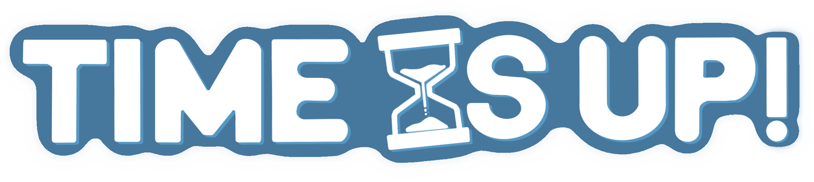

#### Personajes jugables
<u>**SplashKid (Niño Splash):**  al ser un niño con habilidades de agua, se ha querido dar un estilo infantil en donde el personaje se encuentre vestido con una malla de superhéroe y que al mismo tiempo se vea como un neopreno. Se le ha añadido también el casco en forma de pez para dar más sensación de que es un niño pequeño.
</u>

   

Este niño tiene una personalidad inmadura e infantil, debido a su poca edad. En el campo de batalla es algo creativo y posee un ingenio para salir de situaciones peligrosas con gran solvencia. Le gusta mucho divertirse y siente que tiene que salvar al mundo de la situación en la que se encuentra. 

<u>**Tosty Dory (Robot Tostadora):**  para este personaje, al ser un robot que lanza tostadas, se ha querido que a pesar de su tamaño grande, siga teniendo un toque tierno al ser un robot que está tematizado con el entorno de la panadería. 
</u>

   

Este robot posee un gran sentido de la justicia y se ha modificado así mismo para poder hacer frente a la invasión. Odia el conflicto pero quiere proteger a los seres indefensos puesto que tuvo que ver cómo la fusión de los mundos destruyó su fábrica sin poder hacer nada por ella. A pesar de su naturaleza robótica, después de la invasión se ha visto reprogramada a tal forma de casi parecer un ser humano, llegando a poseer atisbo de humanidad y sentimentalidad.

<u>**Petunia (Abuelita Jardinera):** para la abuela, se ha querido borrar el aspecto cariñoso de una abuela jardinera y darle un toque más cañero poniendo unas gafas oscuras al personaje.
</u>

   

Esta anciana vivía plácidamente en su casa con jardín cuando llegó el colapso. Recogió todos los utensilios que pudo de su casa y salvó todas las plantas que pudo de su jardín. El colapso transformó a las plantas haciéndolas agresivas, la anciana llegó a controlar la agresividad de las mismas para su propio beneficio y poder luchar por la vida de su universo. Es una persona calmada y calculadora, tiene una capacidad excepcional para desarrollar estrategias de combates que le permitan resolver cualquier inconveniente con el que se encuentre.

#### Enemigos
**Enemigo base: Minion**
- Criaturas sin mente que patrullan sin rumbo, sembrando el caos y buscando consumir el tiempo de los héroes que se crucen en su camino.

   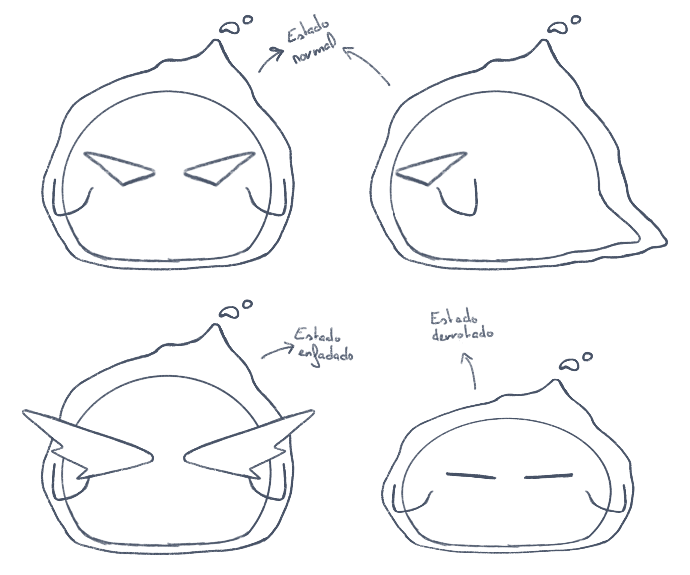

**Enemigo volador: Minion volador**
- Exploradores aéreos de mirada aguda, patrullan zonas estratégicas y atacan solo cuando los jugadores invaden su territorio, manteniéndose siempre fuera de alcance.

   

**Enemigo tanque: Petsy** 
- Fueron guerreros del primer mundo en colapsar; ahora, liberados de su corrupción, son aliados lentos pero poderosos.

   

Este enemigo es capaz de convertirse en tu aliado una vez derrotado, es por ello que cambia su aspecto malévolo por uno más amigable al unirse al jugador:

   

**Enemigo escurridizo: Slipsy** 
- Portadores de una energía vital única, siempre huyen del combate, protegiendo con recelo el tiempo de sus aliados.

   

**Enemigo explosivo: Detonatsy**
- Instigadores del caos, buscan acercarse para autodestruirse junto al héroe, llevándose parte de su tiempo en una explosión mortal. 

   

**Enemigo final: Latsy**
- Mano derecha de la entidad invasora, este implacable guardián defiende su posición con ferocidad, ansioso por robar el tiempo de aquellos que osen enfrentarlo.

### 7.2. Estudio de color
####Interfaces
Se han hecho varias pruebas de color para las interfaces, siguiendo esa temática cartoon con colores llamativos:

   

Finalmente se escogió la paleta de colores de azul con toques rojos:

   

####Personajes
Se han establecido dos paletas de colores generales, una para los personajes jugables y otra para los enemigos, para utilizarlas como referencia.

   
   

A la izquierda encontramos una paleta de colores llamativa para los personajes jugables para dar ese toque familiar y amigable y sobre todo para poder ser fácilmente localizables en el mapa.
Por otro lado, a la derecha encontramos con una paleta de colores más oscuros, definida para los enemigos. 

**Personajes Jugables:**

KidSplash:

   
   

Tosty Dory:

   
   

Petunia:

   
   

**Enemigos:**
Minion:
Para el minion se ha hecho dos versiones, una con degradado como formato final de la apariencia del enemigo, y otra sin degradado en el caso de que resulte complejo añadir este en el proyecto final del juego.

   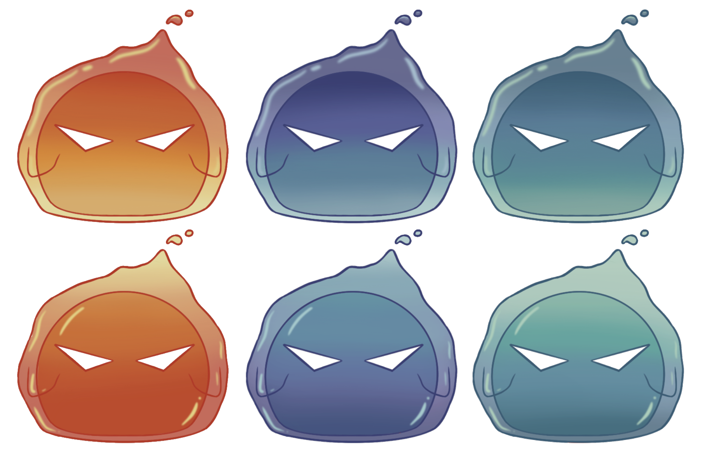
   

   
   

Minion Volador:

   
   

Detonatsy:

   
   

Slipsy:

   
   

Petsy:

   
   

## 8. Arte 3D
### 8.1. Modelado de escenario
<u>**Blocking del primer escenario: fábrica**
</u>
- Primera aproximación de la fábrica en 3D, empleada como “concept” del escenario donde ir probando distintas ideas. El blocking pasa por múltiples iteraciones hasta llegar al modelo final.

   

<u>**Modelo final del primer escenario: fábrica**

   
   
   
   

<u>**Texturas props fábrica**
</u>

   
   
   
   
   
   

<u>**Modelo final fábrica (con texturas)**
</u>

   
   

<u>**Modelo final fábrica en Unity (con texturas)**

   

<u>**Blocking del segundo escenario: isla**
</u>
- Primeros blocking de la isla en 3D, empleados como “concept” del escenario donde ir probando distintas ideas. El blocking pasa por múltiples iteraciones hasta llegar al modelo final, como se puede apreciar en las imágenes.

   
   
   

<u>**Modelo final del segundo escenario: isla**

   
   

<u>**Texturas props isla**

   
   
   
   

<u>**Modelo final isla (con texturas)**

   
   

<u>**Modelo final isla en Unity (con texturas)**

   

### 8.2. Modelado personajes jugables
<u>**Robot Tostadora:**
</u>

   

<u>**Niño Agua:**
</u>

   

<u>**Abuela Jardinera:**
</u>

   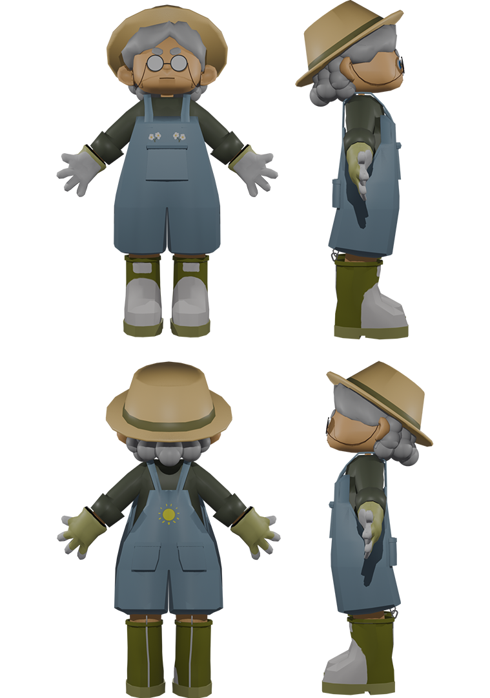

### 8.3. Modelado enemigos
<u>**Minion:**
</u>

   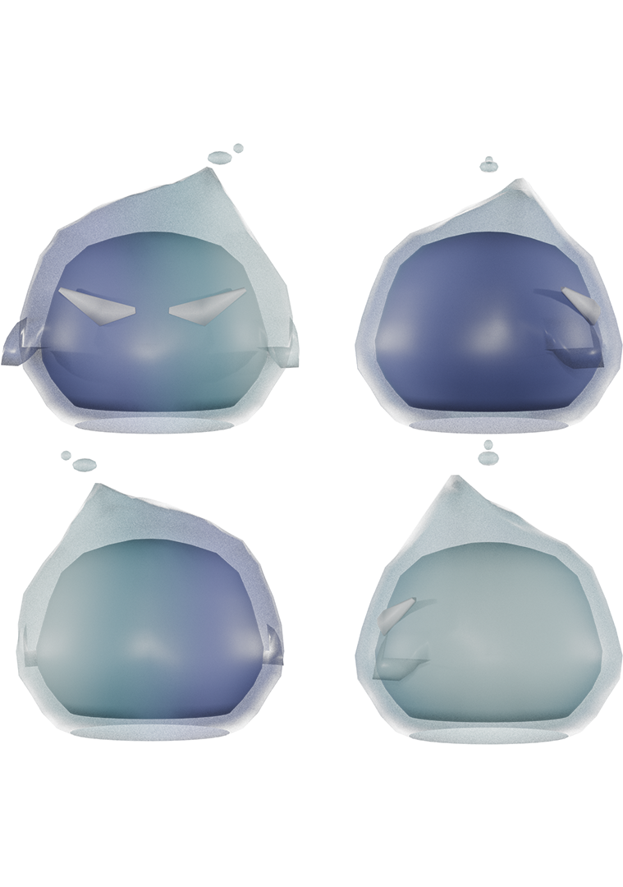

   

<u>**Escurridizo:**
</u>

   

<u>**Golem Enemigo:**
</u>

   

<u>**Golem Aliado:**
</u>

   

<u>**Explosivo:**
</u>

   

<u>**Volador:**
</u>

   

## 9. Animaciones
<u>**Robot Tostadora:**
</u>

   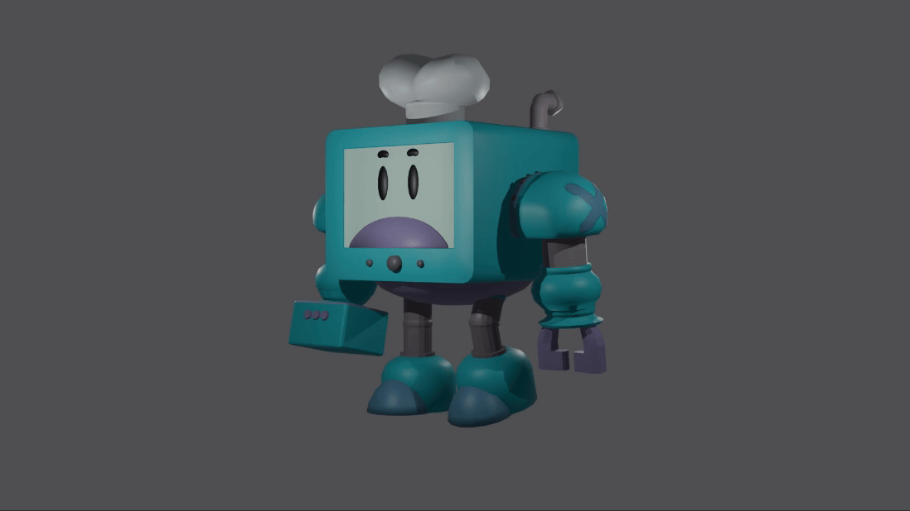
   
   
   

<u>**Niño agua:**
</u>

   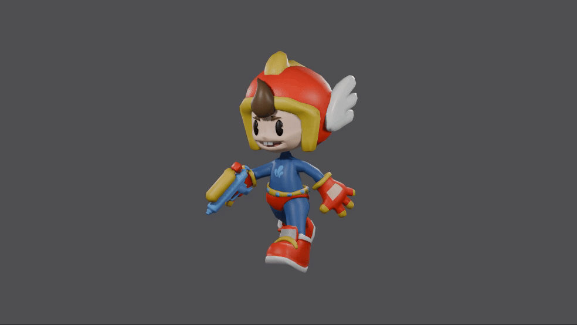
   
   
   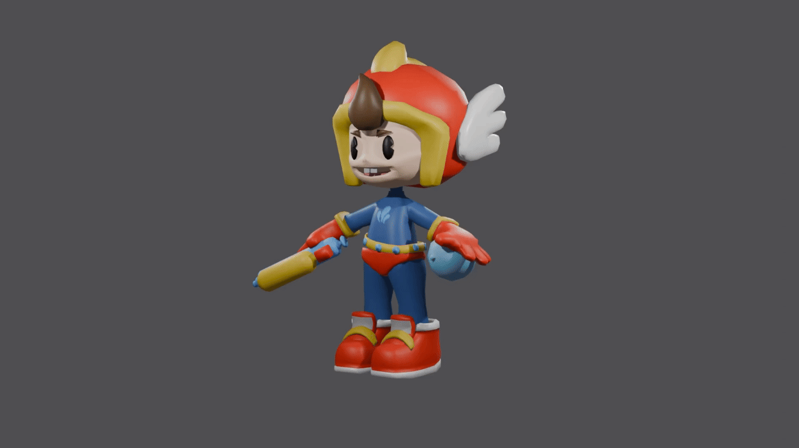
   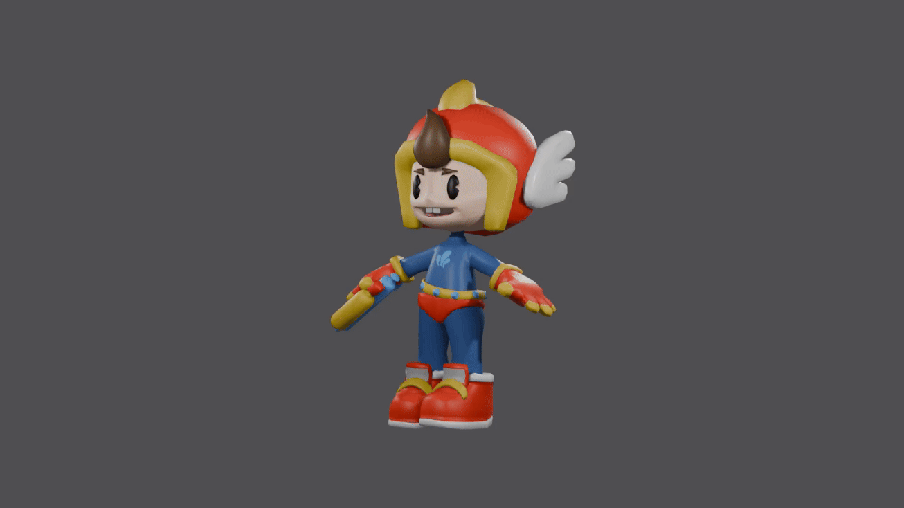

<u>**Abuela Jardinera:**
</u>

   
   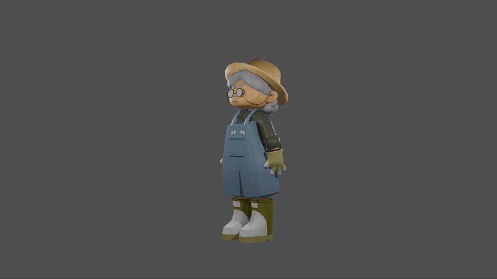
   
   

<u>**Escurridizo:**
</u>

   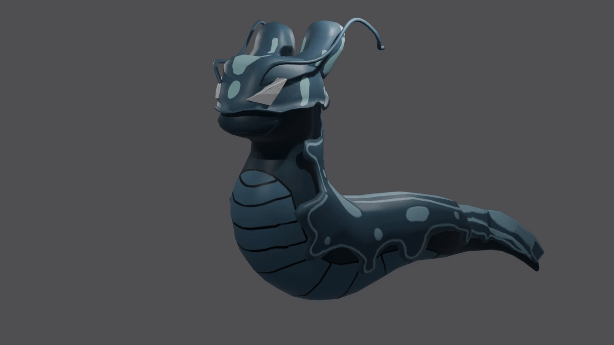
   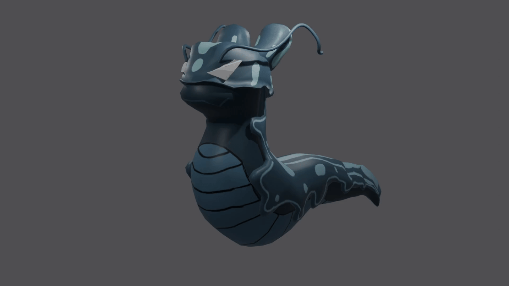

<u>**Explosivo:**
</u>

   
   

<u>**Golem Enemigo:**
</u>

   
   
   
      
   

<u>**Golem Aliado:**
</u>

   
   
   
      
   

<u>**Volador:**
</u>

   
   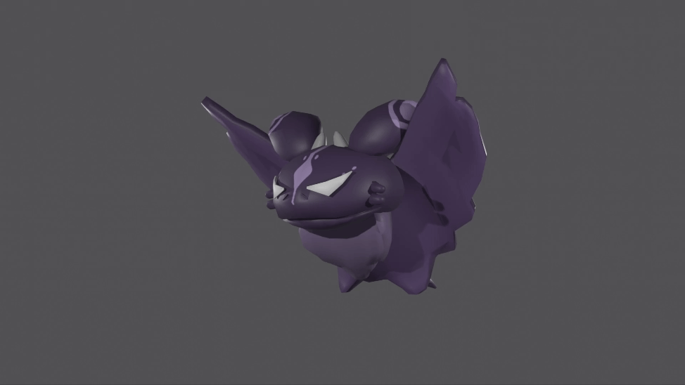
   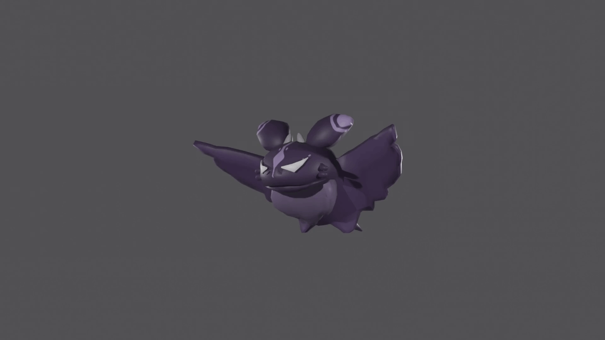

## 10. Música y sonido
**Botones:**
Se ha añadido efecto de sonido para los botones, obtenido de free sound, y editado posteriormente con audacity.
Efecto: https://freesound.org/people/Glaneur%20de%20sons/sounds/104946/ 

**Personajes:**
Los efectos de sonido para los personajes han sido obtenidos en freesound y se han editado sutilmente a posteriori con audacity.
   -	Splash Kid: para Splash Kid se han añadido dos tipos de efectos de sonido, uno para cuando lanza su habilidad, la bomba de agua, y otro para cuando explota esa bomba de agua
   Lanzamiento: https://freesound.org/people/deleted_user_6479820/sounds/394873/ 
   Explosión: https://freesound.org/people/rombart/sounds/186748/

   -	Tosty Dory: pese a que no sea jugable, Tosty Dory cuenta con un efecto de sonido para cuando usa su habilidad, estirar el brazo en forma de gancho.
   Gancho: https://freesound.org/people/kfatehi/sounds/366248/

   -	Petunia: para Petunia se han añadido un efecto de sonido para cuando usa su habilidad y crecen raíces.
   Raíces: https://freesound.org/people/morganpurkis/sounds/396013/ 

## 11. Post-Mortem
### 11.1. Alpha
**- Equipo NeoCore:** en general el equipo, a pesar de haber encontrado problemas inesperados a la hora de realizar el desarrollo de sus actividades, está muy contento con el trabajo realizado, la comunicación y colaboración de todos los participantes. Se considera que se podría haber realizado más para el lanzamiento de esta alpha, porque a pesar de la buena comunicación dentro del equipo, es la primera vez que se trabaja juntos entre muchos de los miembros y todavía falta desarrollar la sinergía grupal para que el desarrollo vaya mucho más fluido, a pesar de esto, se ha realizado un gran trabajo en equipo.

**- niconii:** desde mi punto de vista como diseñadora de niveles y modeladora, pude realizar el blocking, para posteriormente refinarlo y hacer el escenario final sin texturas, para que el equipo de programación pudiese empezar a trabajar con él lo antes posible. Sin embargo, no pude llegar a meter en la alpha las texturas del escenario, ni los props por separado, para que se pudiese editar el nivel más fácilmente en Unity y que los programadores pudieran modificarlo sobre la marcha. Aún así, estoy muy satisfecha con el equipo de desarrollo, ya que tuvimos una idea muy clara del juego desde el primer día y nos organizamos lo más rápido posible para repartir las tareas y realizar partes del proyecto definitivas lo antes posible, A nivel personal, disfrute especialmente realizando las texturas del escenario. Debido a las limitaciones que presenta un juego en web, el modelado del escenario tenía que ser de muy baja poligonización, por lo que en sí el escenario no decía mucho. Pero quise dedicar la mayor parte del tiempo texturizando, para dar personalidad al escenario, así como todo el detalle que le faltaba al modelado, aún siendo texturas de baja resolución.

**- Kr1veN:** en mi caso desde el diseño 3D de los personajes, solo dio tiempo a hacer uno, el robot, y del cual no me quedé contento con la animación que hice de andar. Esto será revisado y mejorado para la siguiente versión. También empecé con un segundo personaje, el niño de agua, pero me bloqueé porque no me convencía lo que estaba haciendo y no me quedaba nada satisfecho con el modelo por mucho que lo cambiase. Hasta que ya después con la encargada de los diseños de personaje se hablaron y cambiaron algunas cosas del diseño y se hizo una segunda versión la cuál nos convivencia a ambos y el modelo avanzó rápidamente después. Una cosa que me gustó fue el rig del robot, el cual costó hacerlo debido a la reducida movilidad del mecha, pero luego de unas cuantas pruebas de ensayo y error se consiguió un rig con el que trabajar bastante bien con los movimientos robóticos del mecha. Pese a ello aún le queda trabajo ya que las animaciones con el rig actual están muy limitadas y eso es un problema. Sin embargo el diseño del mecha quedó bastante bien y se ve un personaje bastante chulo.

**- QueZz:** desde mi perspectiva como programador estoy muy contento con la comunicación fluida que ha habido en todo momento entre el equipo de programación y el equipo de diseño. Desde el principio hemos tenido las ideas claras y nos organizamos lo más rápido que pudimos siguiendo todos una misma idea sobre lo que queríamos tener y no tener dentro del juego. Con mi parte de programador no estoy muy contento, puesto que la parte de generar los enemigos me llevó más tiempo del que debería y aún así va a necesitar retoques cuando estén todos los enemigos programados puesto que hay comportamientos distintos para cada enemigo que requerirán un spawn distinto. Por la parte de narrativa siento que, a pesar de ser un juego multijugador sin posibilidad de singleplayer, se ha creado una historia rica que hace que se entiendan más a los personajes y el entorno del juego para que los jugadores puedan sentirse más o menos representados con ellos teniendo la posibilidad de enriquecer la historia con futuros personajes y escenarios.

**- Raúl:** como programador y encargado de ayudar a quien lo necesite dentro del equipo como soporte extra en su área, para el desarrollo de la alpha, considero que hice mucho énfasis en el desarrollo de la funcionalidad de las interfaces al principio del proyecto, programando funcionalidades que no dieron tiempo a pulirse para la beta, como la selección de personajes, ya que no se habían desarrollado todos ellos. Entre estas funcionalidades destacan el menú principal con ajustes para audio con persistencia, la selección de personajes, y apartados de la interfaz in-game como mostrar el cooldown de una habilidad. Podría haber priorizado el desarrollo de las habilidades de estos para poder mostrar un apartado más cercano a la jugabilidad final que buscamos. En cuanto a ayudar, he estado apoyando el desarrollo del diseño de interfaces y el logo de la empresa. Además, la comunicación ha sido muy fluida a lo largo del proyecto y estoy muy contento con la forma de trabajar del equipo.

**- Rindow:** en mi caso, como encargada de la parte de diseño 2D del juego, a pesar de la dificultad para conseguir inspiración con el tema asignado, estoy contenta con el trabajo que he realizado hasta el momento. Para la alpha he podido desarrollar el logo principal de la empresa, el cual tuvo varias versiones tanto en color como en forma hasta que al final dimos con la definitiva. Por otro lado hice los bocetos de cómo van a ser las interfaces de todo el juego. También hice el turn around de los dos primeros personajes jugables y uno de los enemigos, en un principio me costó el materializar las ideas que habíamos hablado en grupo, ya que al ser personajes que no tienen mucha relación entre sí (niño de agua, robot tostadora y abuela jardinera) quería que tuviesen algo que los uniese, ya sea por el estilo o por el tono en la gama de colores de los personajes. Me costó bastante arrancar al hacer el primer personaje, ya que no sabía qué estilo darle a los personajes y que al mismo tiempo conservarán su personalidad. Tras varias pruebas y después de hacer el niño de agua un par de veces, formé un estilo final cartoon que al mismo tiempo no tuviese demasiado detalle para tener en mente siempre a mis compañeros de modelado 3D y programación. 

**- Xopo:** Como diseñador de juego y programador, estoy contento con el progreso en el juego por el momento. Hemos conseguido un concepto de juego robusto y dinámico con el que el equipo está orgulloso, aparte de consolidar la idea, dejar claras las mecánicas, los personajes, enemigos, elementos del mapa… para que cada persona del equipo pueda llevar a cabo su trabajo con toda la fluidez necesaria. Además, hemos conseguido introducir en la Alpha la estructura básica pero clave del proyecto, integrando todos los elementos necesarios para que el juego funcione correctamente en línea desde Itch.Io, además de haber realizado varias pruebas para asegurarnos de que tenga la optimización necesaria, e implementado varias mecánicas clave de juego correctamente, como el movimiento de los personajes, enemigos básicos y su correcto spawn, el contador de tiempo, disparo, la sincronización entre clientes, entre otros. Si bien al juego todavía le falta forma y trabajo para asemejarse a la idea en nuestra cabeza, tenemos la estructura base del mismo, las mecánicas básicas y la estructura de red, por lo que el resto del desarrollo consiste en ir añadiendo sistemas y puliendo los existentes sin necesidad de preocuparnos por la conectividad más allá de la sincronización.

### 11.2. Beta
**- Equipo NeoCore:** en general el equipo está contento con el trabajo realizado, habiendo conseguido expandir de forma considerable el juego respecto a la alpha, consolidando una base sólida para expandir el desarrollo en un futuro. Sin embargo, los problemas técnicos y la falta de tiempo han acompañado esta fase de desarrollo, haciendo que los miembros del equipo no pudiesen alcanzar los objetivos que se propusieron en un principio. A pesar de esto, el proceso de desarrollo en la fase beta ha permitido identificar las áreas que hay que mejorar y pulir en la versión gold, lo que agilizará el proceso en la próxima fase de desarrollo y permitirá que se cumplan los objetivos inicialmente propuestos.

**- niconii:** respecto al arte 3D de escenarios, conseguí terminar el modelado del segundo escenario del juego de cara a la beta, así como su texturizado. Ya en esta fase de desarrollo conseguí meter los props de ambos escenarios en Unity, darles sus texturas y montar los escenarios en mi escena del juego, añadiendo los colliders necesarios. Para la realización de este segundo escenario no tuve tanto tiempo, y hay elementos del mismo que me gustaría colocar de nuevo de cara a la gold, ya que no pensé detenidamente en cómo se moverían los jugadores por el escenario, y que les haría falta para poder acceder a todas las zonas del mismo.

**- Kr1veN:** Por mi parte en el apartado de los personajes 3D, no me dio tiempo a hacer todas las animaciones que pensé en un primer momento, sobre todo para el personaje del robot. También había algunas que no estaban tan refinadas como me hubiera gustado pero no hubo más tiempo para dedicarle a este apartado. El modelo del golem, estaba pensado que hubiese dos versiones, la enemiga y la aliada que podías invocar, y sólo se pudo modelar uno base que sirviese para los dos. También se tuvo muchos problemas con el apartado de rig, específicamente el robot ha dado muchos problemas durante el desarrollo por esto y no se ha podido incluir su gameplay por fallos del montaje de los huesos. Lo mismo pasa con dos enemigos sobre todo, el minion y el explosivo, los cuales pese a que fueran de los más básicos, sus rigs fueron también muy problemáticos, teniendo que prescindir de animaciones para el minion, y solo añadir alguna básica para el explosivo. Se espera que todo esto se pueda mejorar de cara a la gold, para poder tener un apartado de animación lo más pulido posible. 

**- QueZz:** en cuanto a mi parte en la narrativa y lore del juego estoy contento con cómo quedó la historia sujeta en unos pilares muy firmes, teniendo una base muy sólida por la que poder seguir expandiendo la narrativa sin que entre en conflicto con posibles futuros personajes o enemigos, estableciendo una línea temporal y unos principios adecuados al tipo de juego que se buscaba realizar. Respecto a la parte de programación de enemigos no fue suficiente y quedó muy reducido, a un solo enemigo que se movía de manera aleatoria sin perseguirte ni atacarte. Esto se debió a problemas con el entendimiento del funcionamiento de la API usada para resolver los comportamientos de los enemigos y la falta de comunicación de estos problemas por mi parte al resto del equipo de programación, resultando en una beta con unos enemigos ínfimos, pero con un margen de mejora para su desarrollo para la gold master. Pese a este defecto, quedó una beta divertida de jugar, quedando claro el sistema de juego.

**- Raúl:** en cuanto a la programación de habilidades, dió tiempo a lograr la creación de las habilidades y detección de enemigos en todas ellas, aunque para la release solo funcionase realmente el globo de agua del niño, ya que la implementación del gancho y el stun online se nos complicó. Me apena que finalmente el robot no pudiese ser jugable, su concepto era muy divertido, pero ha dado muchos problemas. Añadí feedback sonoro a los botones para mejorar la UX, buscamos añadir feedback visual a los botones para la beta. Además de esto, creé secciones scrolleables dentro de diferentes apartados de las interfaces, como la tienda, el battle pass, la personalización o las descripciones de los personajes en la selección de personaje. Existían bugs en la pantalla de opciones que se arreglaron, y se implementó un botón en el battle pass que otorgaba experiencia para mostrar el funcionamiento del sistema de nivel. En general, estoy muy contento con el trabajo que realicé de cara a la experiencia de usuario y la usabilidad de las interfaces, aunque aspectos como la creación de una fuente están ya en curso, cosa muy útil para implementar cambios futuros en las interfaces. La comunicación en este tramo del proyecto ha sido algo más escasa, pero ya estamos viendo cómo mejorarla.

**- Rindow:** en mi caso, como encargada de la parte de diseño 2D del juego, me propuse desarrollar los bocetos de todos los enemigos restantes, hacer un estudio de color de los personajes y las interfaces, completar todo el HUD, realizar ilustraciones de los personajes para la selección de personajes y las redes sociales y mantener activos los medios. A medida que avanzaba y lo veía con perspectiva, me propuse demasiadas metas que me llevaron a completar menos de los esperado, pero aun así estoy contenta con lo desarrollado. Pude hacer los bocetos de cuatro enemigos más (Minion Volador, Detonatsy, Slipsy y Petsy), tardando más de lo que creía ya que me costó encontrar referencias de lo que quería plasmar, además de que iba cambiando de idea a medida que lo desarrollaba haciendo que el proceso se alargara más de la cuenta. Por otro lado, hice un estudio de color con las interfaces antes de desarrollarlas todas para ver que colores cuadraban más con la estética del juego, cuando quedé satisfecha me puse a hacer el resto de pantallas. Me dio tiempo también a hacer unas cuantas pequeñas animaciones 2D como por ejemplo la pantalla de carga o el logo de la empresa. Siendo mi primera vez animando en 2D, me siento orgullosa del resultado. En cuanto a las redes sociales, creo que me empeñe demasiado en que estuviera visualmente atractivo, provocando que no se subiese demasiado contenido diario, por ello me he propuesto ponerle más empeño a este punto para las Gold Master.

**- Xopo:** En mi parte, que es la programación y el diseño, los retos más grandes fueron fabricar unas mecánicas y dinámicas que fueran sencillas de entender, se sintieran bien de jugar y que fueran comprensibles para un juego multijugador, además del gran reto de realizar la conectividad del juego. Aún orgulloso por el trabajo realizado, el hecho de que el juego pueda conectar a varias personas y jugar partidas que reflejen las mecánicas de juego, me hubiera gustado haber pulido de mayor manera los sistemas para lograr un flujo de juego más satisfactorio, pulido y profesional, e iterar más con el diseño de juego hasta asegurarme de que encaja como debería. Además, me hubiera gustado añadir más opciones diferentes, como accesibilidad y localización, y diferentes mecánicas que, por falta de tiempo, no han llegado todavía, pero que de cara a la gold máster serían interesantes, como mayor variedad de enemigos.

### 11.3. Gold
- Equipo NeoCore: en general, aunque a todo el equipo le hubiera gustado tener algo más de tiempo para retocar cosas y mejorar ciertos aspectos, la sensación tras la versión 1.0 es muy positiva. Todos nos hemos esforzado mucho en tratar de sacar el mejor producto posible, dado el reto que suponía desde un principio hacer un juego online competitivo en 3D en tan poco tiempo. Algunos aspectos del juego, como el robot o el mapa del barco, se han quedado fuera, pero consideramos que el producto final cumple muy bien con las expectativas que teníamos de este proyecto. Buscamos seguir avanzando su desarrollo, y así lograr pulir los aspectos mencionados.
  
- niconii (Blanca): para la versión Gold corregí los problemas que tenía el segundo escenario, la isla, en cuanto a la movilidad de los jugadores, ya que había zonas que no eran accesibles. Para ello, pude recolocar algunos elementos en Unity y, haciendo uso de los props que había creado ya en la fase beta, creé nuevas estructuras para que los jugadores pudieran moverse más fácilmente, especialmente en el barco, donde no se podía acceder a la parte superior ni al mástil. Me hubiese gustado crear nuevos props para este escenario, sin necesidad de haber recurrido tanto a las cajas de madera para facilitar el movimiento, pero la falta de tiempo no me lo permitió. Aún así, los escenarios han quedado muy parecidos a lo que tenía en mente para el juego final.
  
- Kr1veN (Daniel): no se consiguió arreglar el rig del robot antes de la entrega por bastante problemas y por ello no se pudo incluir como personaje. Se consiguieron hacer todos los modelos incluidos el cambio de golem a sus dos versiones diferentes y el cambio de textura a los estipulados durante el estudio de color. No se consiguieron desgraciadamente incluir animaciones para el minion tampoco desde blender para hacerlo más detallado ni tampoco para el explosivo y escurridizo que se pensaban pulir las animaciones y tratar de incluir alguna extra. Pese a todo, muy contento con los resultados con los personajes, han quedado muy bien teniendo en cuenta la limitación de polígonos y las animaciones pese a no haber podido pulirlas todo lo que se querría han quedado bastante acorde al estilo buscado.
  
- QueZz (Alejandro): para la versión Gold ayudé en la programación de los enemigos, creando el diseño de tanto las máquinas de estado como el diseño de los árboles de comportamiento. Además participé de manera conjunta en la programación de los enemigos apoyando y controlando que los enemigos hiciesen lo que tuviesen que hacer. También aporté ayuda en la búsqueda de efectos de sonido para incluirlos en el videojuego, aunque algunos sonidos no se hayan incluido por problemas de sincronización. Me hubiese gustado desarrollar más ampliamente el lore de los personajes, pero en su totalidad, pese a no haberlo podido hacer, estoy contento con cómo ha quedado la versión Gold del videojuego y con el comportamiento de los personajes puesto que parecía que no nos iba a dar tiempo a pulirlos del todo y al final no ha sido así, haciendo que quede un juego prácticamente idéntico a lo que habíamos pensado en un principio.
  
- Raúl:  para la 1.0, realicé cambios en la implementación de las interfaces gracias a que Andrea creó una fuente propia, lo que hacía mucho más fácil implementar posibles cambios pequeños en las interfaces y feedback a lo hora de usar las interfaces. Además, arreglé diferentes bugs en las habilidades de los personajes y añadí algunos efectos de sonido. La habilidad que más problemas dió fue el gancho del robot, ya que la mano no miraba hacia la dirección indicada durante su trayectoría, y al implementar los comportamientos apareció un bug que movía a todos los enemigos, ya arreglado. En cuánto a la escena de juego, terminé de implementar la interfaz del menú de pausa y retocar el apartado de opciones. Por último, añadí la canción creada por Victor a las distintas escenas. En general, estoy contento con cómo ha salido la versión gold y la comunicación, aunque me apena que finalmente no nos diera tiempo a dejar listo el robot ni el mapa del barco.

  
- Rindow (Andrea): para esta recta final del desarrollo del proyecto, he podido completar algunas tareas que me había propuesto para la anterior fase. He podido desarrollar el estudio de color para los personajes jugables y los enemigos, contando con la opinión del resto del equipo y en ocasiones con los seguidores del juego en las redes sociales para elegir el color final. Este estudio no estaba pensado para ser realizado tan tarde en la fase de desarrollo del proyecto ya que por este retraso mi compañero Dani (encargado del modelado 3D de los personajes) ha tenido que cambiar los colores de estos. Aun así no ha dado problemas y se han establecido los colores acordados lo cual me hace muy feliz. Por otro lado, he ido subiendo al proyecto las partes del HUD por separado para que el equipo de programación las fuera colocando en el proyecto y reutilizando algunas partes para otras interfaces si es necesario. También he organizado, editado y programado las publicaciones de las redes sociales de instagram y X (twitter). La verdad que, a pesar de que no he podido hacer algunas cosas que tenía planeadas, estoy orgullosa del trabajo que he aportado para este proyecto.
  
- Xopo (Manuel Alejandro):  en cuanto a los apartados de diseño y programación, siento que hemos logrado nuestro objetivo de crear una experiencia fluida y dinámica en torno a la mecánica de gestión del tiempo. Uno de los retos que más temía era la gestión de varios enemigos a tiempo real, cada uno con sus comportamientos, mecánicas e interacciones con los jugadores. He de decir que me enorgullezco mucho del resultado, ya que cada enemigo se siente diferente, y es capaz de retar a los jugadores lo suficiente como para forzarlos a usar las nuevas habilidades, las cuales también se esperaban retantes, y siento que conseguimos implementarlas como se imaginaba en un primer momento. Me ilusiona de gran manera que podamos haber dedicado mucho tiempo previo al final del desarrollo para poder probar los sistemas del juego, e introducir los cambios necesarios en base a dichas pruebas. Usualmente es algo que se pasa por alto, y nos ha permitido tener una mucho mayor percepción del juego final, y poder añadir elementos faltantes como sonido u opciones de calidad de vida.
De cara a futuras actualizaciones, me gustaría iterar incluso más en los sistemas implementados del proyecto, y asegurarme de que se sienten todo lo satisfactorio posible, además de añadir contenido que tuvimos que eliminar por falta de tiempo, como el personaje del robot o efectos especiales como los stuns.

## 12. Integrantes del equipo y roles
### Manuel Alejandro Villalba Cruz	
- Programador y diseñador de juego
### Alejandro Tobías Márquez
- Programador y narrativa
### Raúl González Suero
- Programador y polivalente (soporte para el resto del equipo)
### Andrea Gallardo Lasso
- Concept art y diseño de personajes
### Daniel Borrego Cruz
- Artista 3D, modelador y animador
### Blanca García Vera
- Artista 3D y diseño de escenarios

